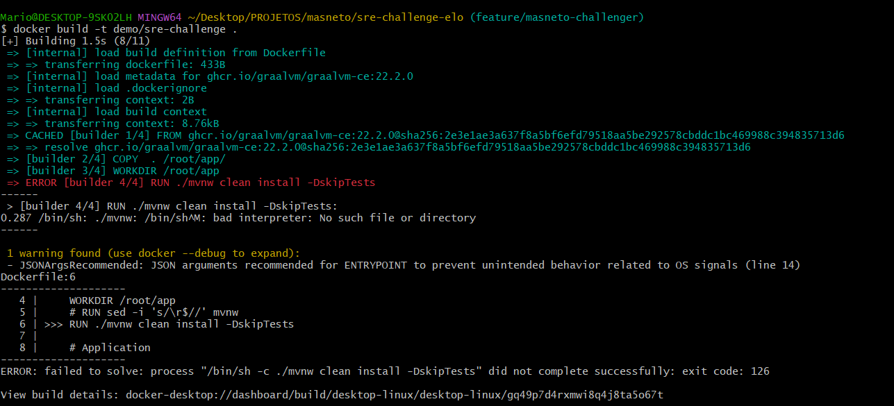
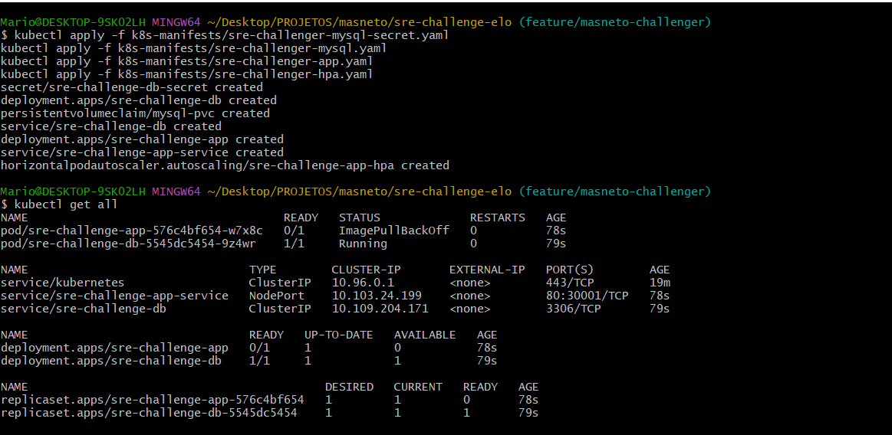
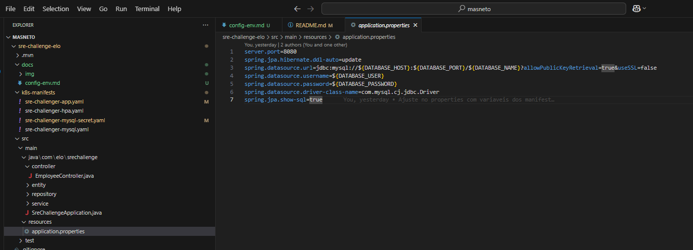

## Bem-vindo

Estamos muito felizes por você estar pensando em se juntar a nós! Esse é um teste feito para conhecer um pouco mais de cada candidato. Não se trata de um teste objetivo, capaz de gerar uma nota ou uma taxa de acerto, mas sim de um estudo de caso com o propósito de conhecer os conhecimentos, experiências e modo de trabalhar de um candidato. Não experamos que tudo seja feito perfeitamente, pois valorizamos o seu tempo. Sinta-se livre para desenvolver sua solução para o problema proposto.

Este desafio está dividido em 4 partes:

1. Implementação
2. Depuração
3. Melhorias
4. Perguntas

## Requisitos para o desafio

- Github Account

Se você encontrar possíveis melhorias a serem feitas neste desafio, fique a vontade para descreve-lás.

## Sobre o Desafio:

A ELO executa a maior parte de sua infraestrutura em Kubernetes. É um monte de microserviços conversando entre si e realizando diversas tarefas.

Nesse repositório, fornecemos a você:

- 'sre-challenge-app/': Uma aplicação com CRUD que armazena dados de funcionários em um Banco de dados MySQL 8.

### Configure o ambiente do desafio

1. Para mais detalhes sobre a configuração do ambiente, consulte o [guia de configuração](docs/config-env.md).

### Parte 1 - Configure os aplicativos

Requisitos

1. A aplicação está sendo acessada pelo endereço http://localhost:30001. Conforme descrito na documentação.
2. Foram criado os seguintes Manifestos:
  ```
  k8s-manifests/sre-challenger-mysql-secret.yaml: Guarda as credenciais do MySQL de forma segura.
  k8s-manifests/sre-challenger-mysql.yaml: Configura o banco de dados MySQL, incluindo armazenamento persistente em caso do pod ser recriado.
  k8s-manifests/sre-challenger-app.yaml: Implanta a aplicação sre-challenge-app e define como ela se conecta ao MySQL.
  k8s-manifests/sre-challenger-hpa.yaml: Ajusta automaticamente o número de réplicas da aplicação com base na carga de CPU.
  ```

### Parte 2 - Corrigir o problema

Pods rodando com sucesso.

```
NAME                                    READY   STATUS    RESTARTS   AGE
pod/sre-challenge-app-fd997f554-84zl4   1/1     Running   0          5s
pod/sre-challenge-db-5545dc5454-zpkmb   1/1     Running   0          6s
```

Problemas encontrados:

Escreva aqui sobre o problema, a solução, como você a encontrou e qualquer outra coisa que queira compartilhar sobre ela.

R: Tive os seguintes erros para execução do processo e no Pod após a aplicação dos manifestos.
- Erro na criação da Imagem.
Tive que acrescentar um comando `sed -i 's/\r$//' mvnw`, para que  a imagem pudesse ser criada. O erro pode ter sido devido a execução ser feita toda pelo Windows, pois tive problemas para emular um SO Linux.



- Erro no pod demo/sre-challenge
Após executar os manifestos eu tive problemas para que o POD criado executasse corretamente, o erro de ImagePullBackOff foi resolvido subindo a aplicação no docker hub com nome do meu usuário nettoremix/sre-challenge.



### Parte 3 - Melhores práticas

Essa aplicação tem uma falha de segurança e gostariamos que as credenciais do MYSQL fossem armazenadas em uma secret do Kubernetes.

Requisitos
1. Manifesto do kubernetes usando a API de secret com as credenciais do Banco para implantação.
2. Manifesto do kunernetes da aplicação com as informações da secret criada anteriormente.
3. Configuração do código da aplicação utilizando uma variável que foi referenciada no secrets do K8s (Application Properties do Java)

Os manifestos foram criados e se encontram na pasta k8s-manifests. Realizei os ajustes no properties para que pegasse as variáveis obtidas pelos manifestos.


### Parte 4 - Perguntas

Sinta-se à vontade para expressar seus pensamentos e compartilhar suas experiências com exemplos do mundo real com os quais você trabalhou no passado.

Requisitos
O que você faria para melhorar essa configuração e torná-la “pronta para produção”?<br>
R: Sugeriria a implementação dos itens abaixo:

- Secrets: Usar ferramenta que gerencie as Secrets de uma forma melhor. 
- TLS/SSL: Implementar TLS/SSL para comunicação segura.
- RBAC: Configurar RBAC para restringir acesso aos recursos.
- Observabilidade e Monitoramento: Utilizar ferramentas do mercado como Kibana, Elastic Search, Grafana, Datadog para monitorar os pods.
- Pipelines: Configurar pipelines de CI/CD como o próprio GitHub Actions. Criando workflows como por exemplo para segregação de ambientes Dev, Hom, Prod. Versionando cada subida para que não haja conflito entre branchs dos times.

Existem 2 microsserviços mantidos por 2 equipes diferentes. Cada equipe deve ter acesso apenas ao seu serviço dentro do cluster. Como você abordaria isso?<br>
R: Poderia ser criado namespaces para a separação por time/microsserviço, criação de policies (Network Policies) e a utilização do RBAC para restringir o acesso de cada time ao seu respectivo microservisso.

Como você evitaria que outros serviços em execução no cluster se comunicassem com o sre-challenge-app?<br>
R: Com a Policy criada, poderia ser ajustado para que permita somente entrada e saida, garantindo que os pods se comuniquem com o sre-challenge-app.

## O que é importante para nós?

É claro que esperamos que a solução funcione, mas também queremos saber como você trabalha e o que é importante para você como engenheiro. Portanto, fique à vontade para criar novos arquivos, refatorar, renomear, ...

Idealmente, gostaríamos de ver sua progressão através de commits, verbosidade em suas respostas e todos os requisitos atendidos. Não se esqueça de atualizar o README.md para explicar seu processo de pensamento.

## Entrega do desafio:

Ao terminar o desafio, convide o 'ELO-SRE' para contribuir com o seu repositório de desafios para que possamos fazer a avaliação. Boa Sorte

<p align="center">
  
</p>
