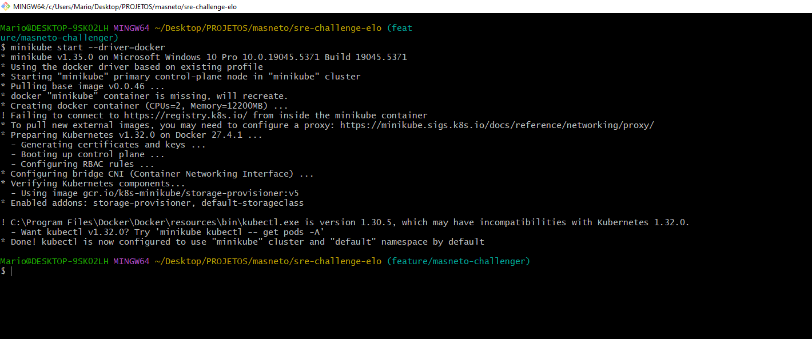
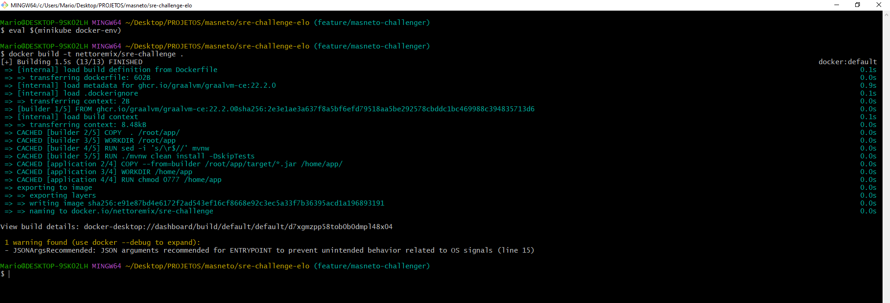
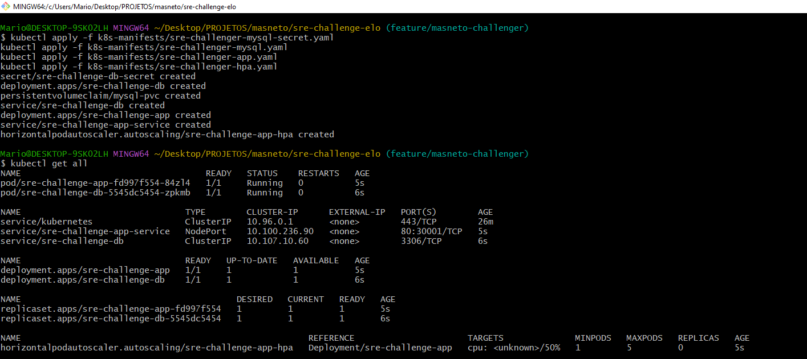
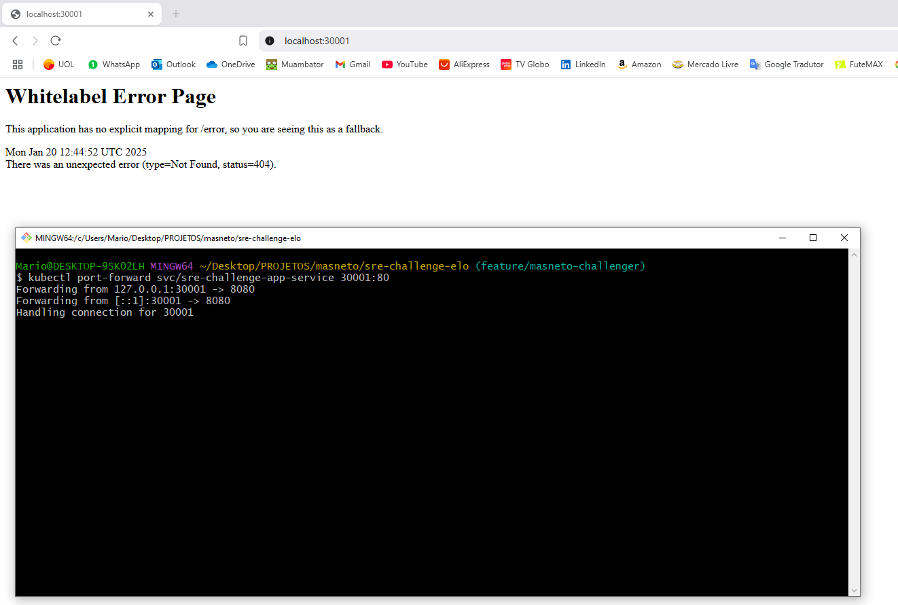
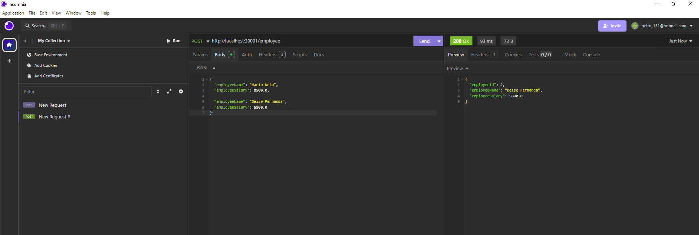
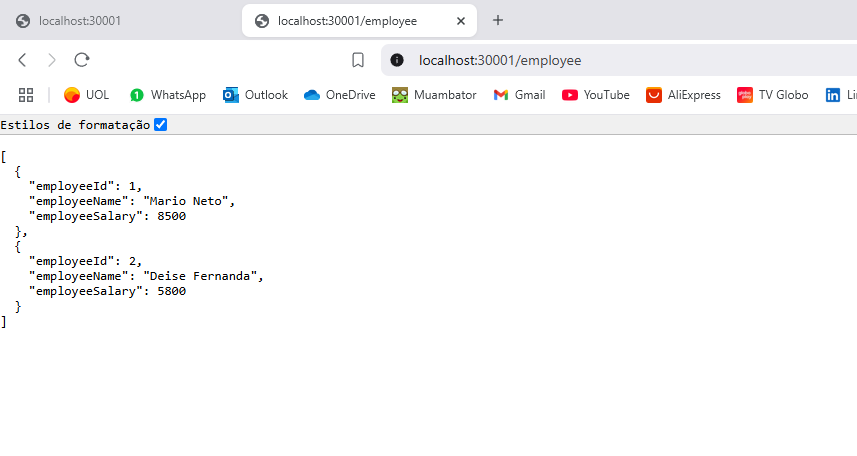

# Configuração do Ambiente com Minikube e Docker no Windows 10

## Requisitos
1. Sistema Operacional: Windows 10 ou superior (64 bits).
2. Programas Necessários: Docker Desktop, Minikube, Kubectl, Apache Maven, e Java JDK.
3. Git Bash (Opcional).

## Passo Opcional - Instalar o Git Bash
1. Baixe o Git Bash no site oficial:  
   [https://git-scm.com/downloads](https://git-scm.com/downloads).
2. Instale o Git Bash:
   - Execute o instalador baixado e siga as instruções.
3. Verifique a instalação do Git Bash:
   - Abra o Git Bash no menu Iniciar ou no atalho criado.
   - Execute o comando abaixo para verificar a versão do Git Bash:  
     ```bash
     git --version
     ```

## Passo 1 - Instalar o Docker Desktop
1. Baixe o Docker Desktop no site oficial e escolha onde baixar, neste caso baixei na pasta Downloads:  
   [https://www.docker.com/products/docker-desktop](https://www.docker.com/products/docker-desktop)
2. Instale o Docker Desktop:
   - Execute o instalador baixado e siga as instruções.
   - Durante a instalação, habilite o suporte ao WSL2 (Windows Subsystem for Linux), se solicitado.
3. Após reiniciar o computador, verifique a versão no CMD ou no Git Bash:  
   ```bash
   docker --version
   ```

## Passo 2 - Instalar o Minikube
1. Baixe o Minikube no site oficial e escolha onde baixar, neste caso baixei na pasta Downloads:  
   Acesse o site oficial: [https://minikube.sigs.k8s.io/docs/start/](https://minikube.sigs.k8s.io/docs/start/)
   - Na seção de binários para Windows, baixe o arquivo executável `.exe`.
2. Instale e configure o Minikube:
   - Faça a execução do instalador.
   - Adicione esta pasta acessível ao PATH do sistema, como `C:\Program Files\Kubernetes\Minikube`.
3. Teste a instalação verificando a versão do Minikube no CMD ou Git Bash:  
   ```bash
   minikube version
   ```

## Passo 3 - Baixar o Kubectl
1. Abra o CMD ou Git Bash na pasta Downloads e digite o comando:  
   ```bash
   curl.exe -LO https://dl.k8s.io/release/v1.32.0/bin/windows/amd64/kubectl.exe
   ```
2. Pegue o arquivo baixado e mova-o para uma pasta no PATH, como `C:\Program Files\Kubernetes\Kubectl`.
3. Verifique a instalação no CMD ou Git Bash:  
   ```bash
   kubectl version --client
   ```

## Passo 4 - Instalar o Apache Maven
1. Baixe o Apache Maven no site oficial:  
   [Apache Maven 3.9.9](https://maven.apache.org/download.cgi)
2. Extraia o arquivo baixado para um diretório, como `C:\Program Files\Apache Maven`.
3. Adicione o caminho `C:\Program Files\Apache Maven\bin` às variáveis de ambiente do sistema (PATH).
4. Verifique a instalação do Maven no CMD ou Git Bash:  
   ```bash
   mvn -version
   ```

## Passo 5 - Instalar o Java JDK
1. Baixe o Java JDK no site oficial:  
   [JAVA](https://www.oracle.com/java/technologies/downloads/?er=221886#java21)
2. Instale o JDK seguindo as instruções do instalador.
3. Adicione o caminho do `JAVA_HOME` às variáveis de ambiente do sistema, como `C:\Program Files\Java\jdk-21.0.X`.
4. Verifique a instalação do Java no CMD ou Git Bash:  
   ```bash
   java -version
   ```

## Passo 6 - Configurar o Minikube com Docker
1. Verifique se o Docker Desktop está em execução e, em seguida, inicie o Minikube usando o driver Docker:  
   ```bash
   minikube start --driver=docker
   ```
2. Verifique o status do cluster:  
   ```bash
   minikube status
   ```



## Passo 7 - Implantação da Aplicação e Banco de Dados
1. Crie as imagens Docker:
   - Navegue até o diretório do projeto contendo o Dockerfile.
   - Foi utilizado o comando abaixo, para construir a imagem diretamente no ambiente do Minikube:
     ```bash
     eval $(minikube docker-env)
     ```   
   - Execute os comandos abaixo no CMD ou Git Bash:  
     ```bash
     docker build -t nettoremix/sre-challenge .
     ```



2. Crie os manifestos Kubernetes:
   - Escreva os arquivos YAML para o Deployment da aplicação, secrets e do banco de dados.
3. Aplique os manifestos nesta sequência no cluster:  
   ```bash
   kubectl apply -f k8s-manifests/sre-challenge-mysql-secret.yaml
   kubectl apply -f k8s-manifests/sre-challenge-mysql.yaml
   kubectl apply -f k8s-manifests/sre-challenge-app.yaml
   kubectl apply -f k8s-manifests/sre-challenge-hpa.yaml
   ```
4. Para verificar se os pods, serviços e HPA foram criados e estã oem execução, execute o comando: 
   ```bash
   kubectl get all
   ```



5. Exponha o serviço da aplicação para acesso externo, mantendo o git bash ou terminal aberto:  
   ```bash
   kubectl port-forward svc/sre-challenge-app-service 30001:80
   ```
6. Acesse a aplicação pelo http://localhost:30001



7. OPCIONAL: Cadastrando funcionários pelo Insomnia. Criando uma requisição POST para o endpoint http://localhost:30001/employee é possível cadastrar um ou mais funcionários por vez em um formato Json.



8. Para acessar os dados dos Funcionários já cadastrados e que estão no volume do banco de dados, deverá ser pelo endpoint http://localhost:30001/employee

